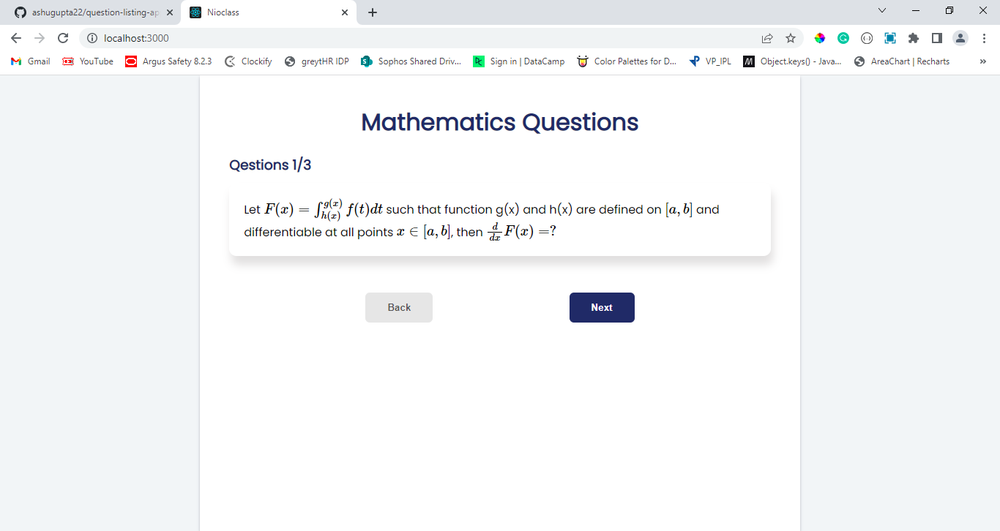

# Overview
---
Created a React application as a part of an assignment to display mathematics equations.
---

# Features
    1. Disply mathematics equations, one at a time using "better-react-mathjax" library.
    2. Dynamic display count of current state of question vs total question.
    3. Button to navigate next and previous question.
    4. Responsive layout.
    5. Provides better and user-friendly UI.

# How to run project locally
## Prerequisites 
- Node.js
- Npm
- React.js
## Steps to run
1. `npm install` to install all dependencies.
2. `npm start` to run a local server and preview page.
3. `http://localhost:3000/` Url will be opened in browser.
